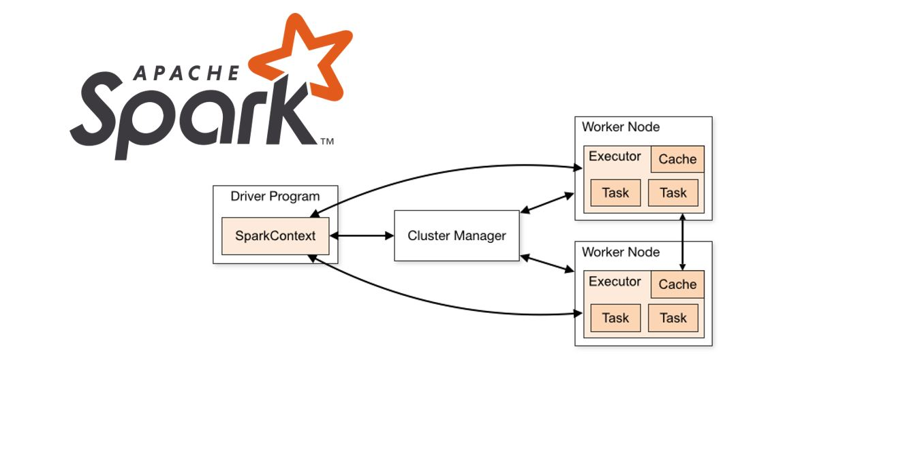
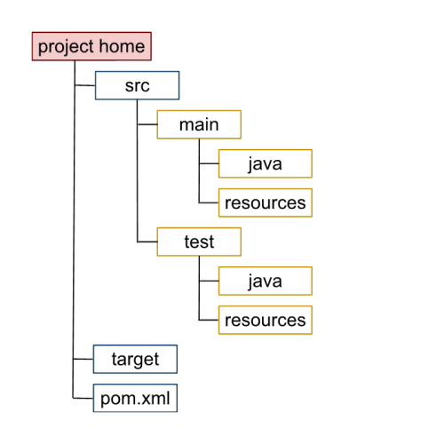
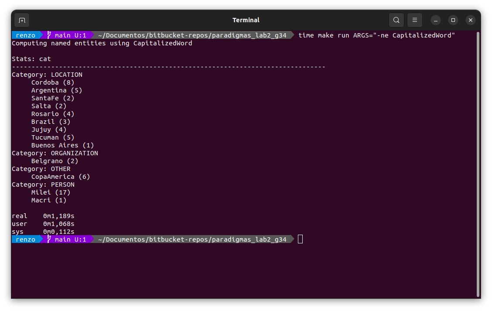
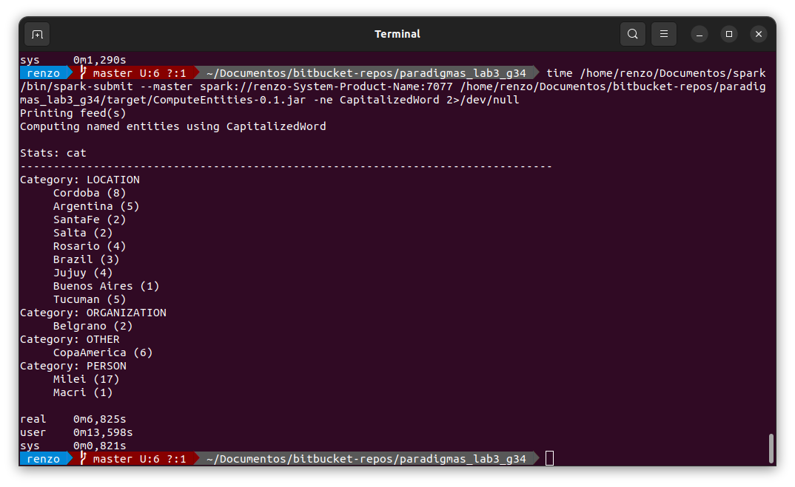
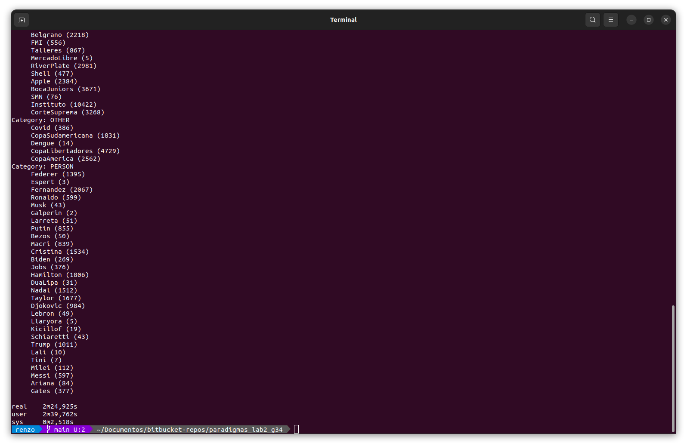
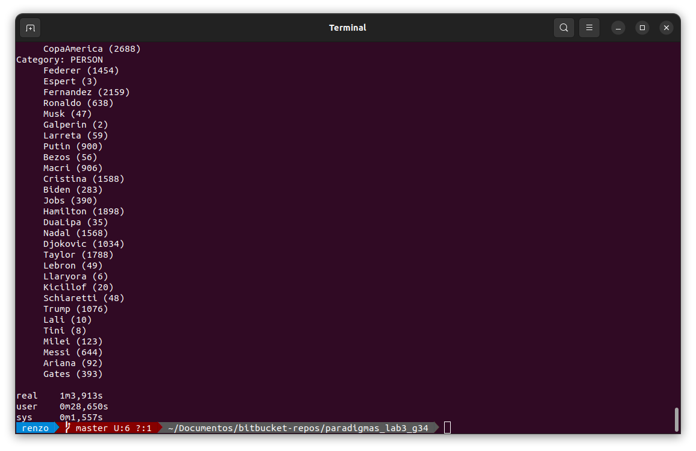

Pueden ver la consigna del laboratorio en https://docs.google.com/document/d/e/2PACX-1vQn5BpCPQ6jKMN-sz46261Qot82KbDZ1RUx8jNzAN4kBEAq_i97T3R6ZA0_yRA5elN66e-EArXQXuAh/pub

# Objetivos
- [ X ] Instalar [maven](https://maven.apache.org/guides/getting-started/maven-in-five-minutes.html) Es probable que sea un paquete de tu distribución (`$ sudo apt install maven` si estás en Ubuntu, Debian o derivados).
- [ X ] Descargar [spark 3.5.1](https://www.apache.org/dyn/closer.lua/spark/spark-3.5.1/spark-3.5.1-bin-hadoop3.tgz) y descomprimirlo en el directorio `DIR`.
- [ X ] Definir variable de entorno `export SPARK_HOME=<DIR>` (ahí `<DIR>` es el directorio donde descomprimieron spark).
- [ X ] Adaptar Laboratorio 2 para las necesidades del Laboratorio 3.
- [ X ] Extraccion de `Name Entities`.
- [ X ] Extraccion de `Name Entities` Paralelizada con Spark.
- [ X ] Clasificacion de `Name Entities` Paralelizada con Spark.

# Informe

# Introducción
## ¿Que es Apache Spark?
Apache Spark es un motor unificado de analíticas para procesar datos a gran escala que integra módulos para SQL, streaming, aprendizaje automático y procesamiento de grafos.
En este laboratorio Spark es utilizado para paralelizar el computo de entidades nombradas utilizando un modelo Master/Slave donde el Master se encarga de distribuir entre los esclavos. 

En el laboratorio anterior la implementación era útil para textos pequeños/medianos donde no se necesitaba mucha potencia de calculo, ahora buscamos implementar computación paralela para poder calcular las entidades nombradas con una gran cantidad de información.

Para lograr implementar el manejo de bigData en nuestra aplicacion hacemos uso de la API de Spark para Java.

## Ventajas de usar Apache Spark

* Rapidez: Como ya explicamos paraleliza el trabajo para mayor velocidad de calculo.
* Facilidad de uso: Tiene un API´s para varios lenguajes de programación sencillas de utilizar y bien documentadas.
* Ampliamente utilizado: Es el framework de computacion paralela mas utilizado por lo que también tiene una gran comunidad lo que facilita buscar informacion sobre errores que otros ya tuvieron y fueron solucionados.
* Uso general: Spark permite usar una pila de bibliotecas que incluye SQL, DataFrame, MLlib para aprendizaje automático, GraphX y Spark Streaming. Además, puedes combinarlas sin problemas en la misma aplicación.
## ¿Como funciona la arquitectura Master/Slave?

Se utiliza un nodo principal padre (Master) que se va a encargar de procesar la petición del usuario enviada, dividir la big data entre sus Slaves y estos últimos se van a encargar de procesar la información que les llego para luego devolverle el resultado al Master que una vez que todos sus Slaves le hayan devuelto la información va a entregarle al usuario el resultado final del computo.

Esto representa una clara estrategia de divide y venceras para aumentar la velocidad a la que se realiza el calculo de entidades y de esta forma poder manejar grandes cantidades de información.



# Estructura del proyecto con Apache Maven

## ¿Que es Apache Maven?

**[Apache Maven](https://maven.apache.org/)** es una potente herramienta de gestión de proyectos que se utiliza para gestión de dependencias, como herramienta de compilación e incluso como herramienta de documentación. Es de código abierto y gratuita.

Aunque es utilizada en distintos lenguajes se usa principalmente con proyectos de Java. Maven utiliza convenciones sobre dónde colocar ciertos archivos para el proceso de _build_ de un proyecto.

Además, es una **herramienta declarativa**. Es decir, todo lo que definamos (dependencias en módulos y compontes externos, procesos, orden de compilación, _plugins_ del propio Maven...) se almacena en un archivo XML que Maven lee a la hora de funcionar.

Maven es capaz de:
* Gestionar dependencias
* Compilar código fuente
* Empaquetar código
* Instalar paquetes
* Generar documentación
* Gestionar fases del proyecto

## ¿Que es el archivo pom.xml?
La unidad básica de trabajo en Maven es el llamado **Modelo de Objetos de Proyecto** conocido simplemente como **POM** (de sus siglas en inglés: _Project Object Model_).

Se trata de un archivo XML llamado `pom.xml` que se encuentra por defecto en la raíz de los proyectos y que **contiene toda la información del proyecto**: su configuración, sus dependencias, etc.

Incluso, aunque nuestro proyecto, que usa Maven, tenga un archivo `pom.xml` sin opciones propias, prácticamente vacío, estará usando el modelo de objetos para definir los valores por defecto del mismo. Por ejemplo, por defecto, el directorio donde está el código fuente es `src/main/java`, donde se compila el proyecto es `target` y donde ubicamos los test unitarios es en `src/main/test`, etc... Al `pom.xml` global, con los valores predeterminados se le llama **Súper POM**.

Esta sería la estructura habitual de un proyecto Java que utiliza Maven:



## Carpeta target

La carpeta `target` es utilizada por Maven para almacenar todos los artefactos generados durante las fases de construcción, pruebas y empaquetado del proyecto. Actúa como un directorio temporal donde Maven maneja todo el trabajo pesado del proceso de construcción.

En esta carpeta se suelen encontrar las clases compiladas, archivos jar, registros, archivos temporales, etc. La estructura de nuestra carpeta es la siguiente:

target/


├── classes/ <- Se encuentran las clases utilizadas en el proyecto anterior


│


├── maven_archiver/ <- Propiedades del proyecto

|


├── maven_status/ <- Estado del proyecto


|


├── target/ComputeEntities-0.1.jar <- .jar con el proyecto empaquetado

# Modificaciones al lab anterior para soportar Apache Spark

Lo que debimos modificar del laboratorio anterior para adaptarlo a la API de spark fue:

* Tuvimos que hacer que las clases CategoryMap, JSONDict, TopicMap, HeuristicMap, Heuristic implementen la interfaz `Serializable`. 

El motivo de esta modificacion es que es necesario que las clases implementen esta interfaz para que puedan ser serializadas y enviadas a los nodos del cluster.

* Removimos la opcion para elegir feeds.

Eliminamos la opcion de elegir feeds dado que ahora se solicita tomar todas las feeds para calcular las entidades nombradas y no hace falta elegir una en particular.

* Modificamos JSONDict pues los JSONArray no implementan `Serializable`.

Antes utilizabamos JSONArrays para parsear el diccionario pero esto provocaba problemas a la hora de serializar, en su lugar decidimos utilizar List<String> como tipo para retornar en los metodos y solucionar este problema.

* Removimos App.java y utilizamos todo el codigo dentro del archivo ComputeEntities.java

Cambiamos el archivo principal de la aplicacion por otro conservando gran parte del codigo, removimos partes innecesarias dado que quitamos la opcion de elegir feeds y agregamos el codigo necesario para utilizar Spark en nuestra aplicacion.


# Implementación con API de Spark

## Traza general del programa

Antes de computar las entidades nombradas hay que llevar a cabo ciertos preparativos, como saber con que feeds y heuristicas estamos trabajando.

Ademas, hay extraer los datos de los articulos para generar el BigData.

```java
public static void main(String[] args) {

    //Obtener los Feeds.
    List<FeedsData> feedsDataArray = new ArrayList<>();
    try {
        feedsDataArray = JSONParser.parseJsonFeedsData("./src/main/java/data/feeds.json");
    } catch (IOException e) {
        e.printStackTrace();
        System.exit(1);
    }

    //Obtener las Heuristicas.
    List<HeuristicData> heuristicDataArray = new ArrayList<>();
    try {
        heuristicDataArray = JSONParser.parseJsonHeuristicData("./src/main/java/data/heuristics.json");
    } catch (IOException e) {
        e.printStackTrace();
        System.exit(1);
    }

    UserInterface ui = new UserInterface();
    Config config = ui.handleInput(args);

    run(config, feedsDataArray, heuristicDataArray);
}

private static void run(Config config, List<FeedsData> feedsDataArray, List<HeuristicData> heuristicDataArray) {
    superAssert(config, feedsDataArray, heuristicDataArray);      //Chequea Errores de Input
    configPrintHelp(config, feedsDataArray, heuristicDataArray);  //Imprime las opciones de Ayuda en caso de que sean Solicitadas.
    List<Article> allArticles = new ArrayList<>();
    allArticles = configProcessFeed(config, feedsDataArray);      //Parsea el Feed y obtiene la Informacion de los Articulos.
    configPrintFeed(config, allArticles);                         //Escribe la Informacion de los Articulos en bigdata.txt
    configComputeNamedEntities(config, allArticles);              //Computa y Clasifica las Entidades Nombradas Usando Spark.
}

```

## Computacion de entidades nombradas usando Spark


Utilizamos los metodos de la API de Spark para crear una sesion la cual es el punto de entrada para utilizar las funcionalidades de spark, luego inicializamos el contexto de Spark para poder trabajar con RDDs


```java
SparkSession spark = SparkSession
    .builder()
    .appName("JavaComputeEntities")
    .getOrCreate();

JavaSparkContext jsc = new JavaSparkContext(spark.sparkContext());
```


Obtenemos la heuristica especificada por el usuario


```java
if (config.getComputeNamedEntities()) {
    String heuristic = config.getHeuristicKey();
    System.out.println("Computing named entities using " + heuristic);

    Heuristic heuristicFunc = HeuristicMap.getHeuristic(heuristic);

```

Creamos los RDDs a partir de la lista de articulos utilizando el metodo paralelize luego extraemos titulos y descripciones de los articulos creando RDDs separados. 

Si es que se especifica un archivo, lo leemos como un RDD. Si no, se combinan titulos y descripciones en un unico RDD.

```java
JavaRDD<Article> articulosRDD = jsc.parallelize(allArticles, 4);

JavaRDD<String> titulosRDD = articulosRDD.map(Article::getTitle);
JavaRDD<String> descsRDD = articulosRDD.map(Article::getDescription);
JavaRDD<String> textoRDD;

if(config.getSpecificFile()) {
    String filePath = config.getFilePath();
    textoRDD = jsc.textFile(filePath, 4);
} else {
    textoRDD = titulosRDD.union(descsRDD).repartition(4);
}

```

Extraemos las entidades nombradas almacenandolas en candidatesListRDD y luego los separamos en strings individuales

```java
JavaRDD<List<String>> candidatesListRDD = textoRDD.map(heuristicFunc::extract).cache();
JavaRDD<String> candidatesRDD = candidatesListRDD.flatMap(List::iterator);

```

Clasificamos las palabras primero cargando el diccionario que contiene las categorias y los topicos, luego creamos las variables necesarias para distribuir los datos para despues hacer el conteo de las entidades nombradas.

```java
JSONDict dict = new JSONDict("./src/main/java/data/dictionary.json");

final Broadcast<JSONDict> dictBroadcast = jsc.broadcast(dict);

CategoryMap categoryMap = new CategoryMap();
TopicMap topicMap = new TopicMap();

JavaPairRDD<String, Integer> ones = candidatesRDD.mapToPair(s -> new Tuple2<>(s, 1));

JavaPairRDD<String, Integer> counts = ones.reduceByKey(Integer::sum);

JavaRDD<Tuple2<String, Integer>> tupleRDD = counts.map(tuple -> new Tuple2<>(tuple._1(), tuple._2()));

```

Extraemos toda la informacion necesaria sobre las `Entities`.

```java
JavaRDD<Tuple2< Tuple2< List<String>, Tuple2<String,String> >, Integer>> infoRDD = tupleRDD.map
(new Function<Tuple2<String, Integer>, Tuple2< Tuple2< List<String>, Tuple2<String,String> >, Integer>>() {
    @Override
    public Tuple2< Tuple2< List<String>, Tuple2<String,String> >, Integer> call(Tuple2<String, Integer> entidad) throws Exception {
        JSONDict dictLocal = dictBroadcast.value();
        String cat = "";
        String label = "";
        List<String> topics = new ArrayList<>();
        for (int i = 0; i < dictLocal.getLength(); i++) {
            List<String> keywords = dict.getKeywords(i);
            if(keywords.contains(entidad._1())){
                cat = dictLocal.getCategory(i);
                label = dictLocal.getLabel(i);
                topics = dictLocal.getTopic(i);
            }
        }

        return (new Tuple2<>(new Tuple2<>(topics, new Tuple2<>(cat, label)), entidad._2()));
    }
});

```

Recolectamos la la informacion obtenida y la guardamos en los `categoryMap` y `topicMap`.
```java
List<Tuple2< Tuple2< List<String>, Tuple2<String,String> >, Integer>> output = infoRDD.collect();

for (Tuple2<Tuple2< List<String>, Tuple2<String,String> >, Integer> tuple : output) {
                
    String cat = tuple._1()._2()._1();
    String label = tuple._1()._2()._2();
    List<String> topics = tuple._1()._1();

    if (!topics.isEmpty() && cat.length() != 0 && label.length() != 0) {
        for (int j = 0; j < tuple._2(); j++){
            categoryMap.addEntity(topics, cat, label);
            topicMap.addEntity(topics, label, cat);
        }
    }
}

```

Luego imprimimos los resultados igual que en el laboratorio anterior y limpiamos cerrando la sesion de spark.

```java
String statsFormat = config.getStatsFormat();
System.out.println("\nStats: " + statsFormat);
System.out.println("-".repeat(80));

if (statsFormat.equals("cat")) {
    categoryMap.print();
} else {
    topicMap.print();
}


jsc.close();
jsc.stop();
spark.stop();
```


## Resumen

La computacion de entidades nombradas consiste en:

1. Inicialización: Se inicia una sesión de Spark y un contexto de Spark.


2. Carga de datos: Se cargan y procesan los artículos.


3. Extracción de entidades: Se aplican heurísticas para extraer entidades nombradas.


4. Conteo y clasificación: Se cuentan y clasifican las entidades.


5. Actualización de datos: Se actualizan los datos de categoria y topicos.


6. Impresión de resultados: Se imprimen las estadísticas.


7. Cierre: Se cierran los recursos de Spark.


# Cómo compilarlo

Sea `APP_HOME` el directorio donde está este archivo `README.md`

```bash
$ cd $APP_HOME
$ mvn install
```
Eso descarga las dependencias que necesitamos y crea el directorio `target` donde queda el jar que nos interesa.
En mi caso:
```
$ ls target
classes  generated-sources  generated-test-sources  maven-archiver  maven-status  test-classes  WordCount-0.1.jar
```
Posteriormente para compilar y empaquetar hacemos como sigue:

```bash
$ cd $APP_HOME
$ mvn compile
$ mvn clean package
```

# Cómo usarlo

Para utilizar la aplicacion hacemos, en el mismo `$APP_HOME`: 

```bash
$ $SPARK_HOME/bin/spark-submit --master $MASTER $APP_HOME/target/ComputeEntities-0.1.jar  $FLAGS
```

donde 
`$SPARK_HOME` es el directorio donde esta descargado Spark.

`$MASTER` es el master que deseamos utilizar para distribuir el programa. 
Pudiendo ser el `url` un cluster abierto desde la carpeta de Spark o simplemente `local[n]` para usar `n` workers virtuales. 

`$FLAGS` son los Flags con los que deseamos correr el Lab, como por ejemplo "-ne SinArticulos".

A modo de Ejemplo
```bash
$ /home/salchi/Desktop/Paradigmas_Lab_3/spark-3.5.1-bin-hadoop3/bin/spark-submit --master spark://salchi-VM:7077 /home/salchi/Desktop/Paradigmas_Lab_3/paradigmas_lab3_g34/target/ComputeEntities-0.1.jar -ne SinArticulos
```
donde
`$APP_HOME`: /home/salchi/Desktop/Paradigmas_Lab_3/paradigmas_lab3_g34
`$SPARK_HOME`: /home/salchi/Desktop/Paradigmas_Lab_3/spark-3.5.1-bin-hadoop3
`$MASTER`: spark://salchi-VM:7077
`$FLAGS`: -ne SinArticulos

## Cluster de Spark

Para crear un Master y dos Slaves debemos dirigirnos a `$SPARK_HOME`

Alli primero iremos a `$SPARK_HOME/conf/` y crearemos el archivo `spark-env.sh` con el siguiente contenido:

`$SPARK_HOME/conf/spark-env.sh`:
```bash
SPARK_WORKER_CORES=1
SPARK_WORKER_INSTANCES=2
SPARK_WORKER_MEMORY=1g

```
Luego iremos a `$SPARK_HOME/sbin/` y ejecutaremos:

```bash
$ ./start-master.sh

```
Esto creara un proceso Master. Podemos ver que esta activo si vamos a `http://localhot:8080`

Luego hacemos
```bash
$ ./start-worker.sh spark://$LOCALHOST:7077

```
Donde `LOCALHOST` es el nombre del Equipo.
Podemos revisar el nuestro en `http://localhot:8080`, donde el Apartado de `URL` es lo que debemos poner
a continuacion del `start-worker.sh`.

Por ejemplo:
```bash
$ ./start-worker.sh spark://salchi-VM:7077

```

Ahora deberiamos ser capaces de ver nuestros Slaves en `http://localhot:8080` bajo el nombre de Workers. 
De ser asi se puede proceder a ejecutar nuestra App con `spark://$LOCALHOST:7077` como `$MASTER`. 

# Comparativa Lab 2 vs Lab 3

A continuación mostraremos un par de capturas en la cual comparamos los tiempos en que tardan en procesar las Entities el lab2 y lab3

### Caso en el que procesa todos los feeds ---> LAB-2



### Caso en el que procesa todos los feeds ---> LAB-3



### Caso en el que procesa el feed grande que dió Pagano por zulip (1.52GB de datos) ---> LAB-2



### Caso en el que procesa el feed grande que dió Pagano por zulip (1.52GB de datos) ---> LAB-3



## Conclusión

Como podemos ver en el primer caso cuando tenemos pocos datos que procesar, el lab2 va a ganar ya que no tiene que hacer más cosa que procesar las Entities, mientras que el lab3 tiene el overhead de spark de dividir y coordinar las tareas con los workers.

Sin embargo en el caso en el que procesamos el feed grande (los datos que dió pagano de una wiki con 1.52GB de datos), claramente vemos una mejora bastante grande para el lab3, en la cual el tiempo en el que tardó en procesar las Entities es prácticamente el doble, esto gracias al `divide y vencerás` ya que tenemos 2 workers trabajando en paralelo sobre los datos.

